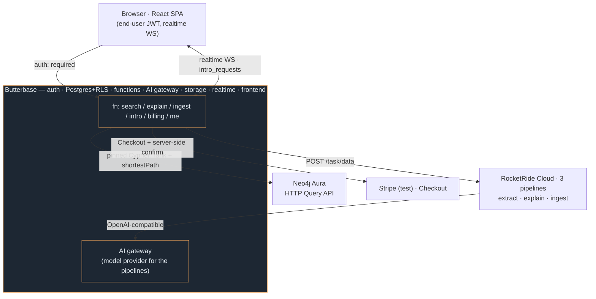

# WarmPath

**Find who actually knows about a topic inside your organisation — and how to reach them through people you already trust.**

Live: **https://warmpath-glazed.butterbase.dev**
Demo accounts: `maya.demo@warmpath.dev` (requester) and `chen.demo@warmpath.dev` (the expert who consents) — password `WarmPath!2026`.

---

## The problem

In a large org, "who actually knows about X" dies in Slack. Directories list job titles, not expertise. And even once you find the right person, cold-pinging a stranger rarely works.

## The solution

WarmPath models people, skills, projects and collaboration as a Neo4j property graph. An agent interprets a natural-language question, traverses the graph to rank experts by **proficiency then collaboration centrality**, and computes the **shortest collaboration path** from you to each expert. It returns not just *who* to talk to, but *how to reach them warmly* — with evidence for why they're the expert and the real shared history on every hop of the chain.

Introductions are **double-consent**: the expert's contact details do not exist on the request row until they accept.

---

## Architecture



**Query path** (every search): browser → Butterbase `search` fn → RocketRide extracts the skill → Neo4j ranks experts + traces the ≤4-hop warm path → `explain` fn → RocketRide writes the briefing. Both pipelines use Butterbase's AI gateway as their model provider, so Butterbase is load-bearing *inside* RocketRide too.

**Ingestion path** ("grow the graph"): browser → `ingest` fn → RocketRide extracts `{person, skill, evidence}` triples → the backend MERGEs them into Neo4j with deterministic Cypher. New expertise is searchable, with a warm path, seconds later.

**Consent path**: double-consent enforced in Postgres RLS; when the expert accepts, a realtime WebSocket pushes the update to the requester live, the drafted intro is saved to Butterbase Storage, and contact is revealed.

The browser never holds the RocketRide key, the Neo4j password, or any Stripe secret. All live in the functions' encrypted `envVars`. RocketRide pipelines are **self-healing** — specs live in a `pipeline_state` table and any function recreates a terminated pipeline and retries, so a stale token can never break a search.

### Why each platform is load-bearing

**Neo4j** — the product *is* the path. `shortestPath((requester)-[:COLLABORATED_WITH*..4]-(expert))` plus `COUNT { (p)-[:COLLABORATED_WITH]-(:Person) }` for degree centrality. Both are core Cypher (no GDS, no APOC). Ranking experts by proficiency and then by centrality, and returning the intermediate brokers with the context of each relationship, cannot be reproduced with flat rows.

**RocketRide Cloud** — two pipelines are deployed to `api.rocketride.ai` and invoked on **every single search at runtime**, not at build time. One turns the question into a canonical skill; the other writes the introduction briefing from the graph rows.

**Butterbase** — end to end: email/password **auth** (every route gated) with a post-auth **hook** that binds graph identity server-side, the **Postgres database** with **row-level security** that enforces double-consent, the **AI gateway** that powers all three RocketRide pipelines, six **serverless functions**, **realtime** WebSockets for the live consent inbox, **storage** for the downloadable intro, **payments** (Stripe Checkout via a function), and the **deployed frontend**.

---

## Graph model

```
(:Person {id, name, title, team, email})
(:Skill {name, category})
(:Project {name, description, year})
(:Team {name})

(Person)-[:HAS_SKILL {proficiency: 1-5, evidence: string}]->(Skill)
(Person)-[:WORKED_ON]->(Project)
(Person)-[:MEMBER_OF]->(Team)
(Person)-[:COLLABORATED_WITH {strength: 1-10, context: string}]->(Person)
(Project)-[:USES_SKILL]->(Skill)
```

`USES_SKILL` is what lets us surface people who never *claimed* a skill but demonstrably shipped a project that used it. Those show as "Not rated · project evidence" rather than a misleading proficiency of zero.

`COLLABORATED_WITH` is stored directed but always traversed **undirected** (`-[:COLLABORATED_WITH*..4]-`). Its `strength` drives the colour and thickness of every segment of the path in the UI: strong ties glow ember, weak ties stay cold slate. Nothing in the interface looks warm unless the data says it is.

### Seed: "Meridian Systems"

80 people, 8 teams, 25 projects, 35 skills, 243 collaboration edges. Generated from a **seeded PRNG** so the graph is byte-identical on every run, with a hand-pinned "spine" and a blocklist of forbidden pairs that the random generator must skip. Three demo scenarios are therefore provable, not lucky:

| Scenario | Guarantee |
|---|---|
| "Who knows about SAP integration?" | Chen Wei, proficiency 5, *"built the SAP connector for Project Atlas"*, exactly **2 hops** via Priya Nair. There is no direct Maya–Chen edge, so the brokering is real. |
| "We keep having pod evictions in prod" | Arjun Mehta and Tomas Novak both have Kubernetes at proficiency 5. The tie is broken purely by **degree centrality** — 12 collaborators vs 3. |
| "Need someone who understands fraud models" | Sofia Ramos, exactly **3 hops**: Maya → Priya → Arjun → Sofia, each edge carrying real shared context. |

`node scripts/seed.js --verify` asserts all six invariants.

---

## Double consent

This is enforced in Postgres, not in the UI.

- **Consent #1** — the requester inserts the row. RLS `with_check`: `requester_id = current_user_id()::uuid`.
- **Consent #2** — only the expert may accept. RLS policy `intro_update_expert_only` restricts `UPDATE` to the account whose `profiles.person_id` matches the row's `expert_person_id`.
- `expert_email` is `NULL` on the row until acceptance. A requester who queries the REST API directly, bypassing the app entirely, sees nothing.

`scripts/e2e.js` proves the negative cases: contact is refused before consent, the requester cannot accept on the expert's behalf, and a raw `PATCH /intro_requests/{id}` from the requester is rejected by the policy.

---

## Payments

Free plan = 3 searches, enforced server-side in `functions/search.ts` (the count is read from the database on every call; a client flag would be trivially bypassed). The 4th search returns **HTTP 402** and the app opens the paywall.

Butterbase's native app billing runs on a **live-mode** Stripe Connect platform (`livemode: true`), which would require real bank and identity details and a real charge — unusable for a demo that must accept card `4242 4242 4242 4242`. So `functions/billing.ts` drives Stripe Checkout directly with a test-mode key. On return, the server **re-fetches the session from Stripe** and verifies `client_reference_id` matches the caller before upgrading the plan; it never trusts the browser's claim that it paid.

---

## Repo layout

```
pipelines/       RocketRide Cloud pipeline definitions (JSON) + deploy script
  warmpath-extract / warmpath-explain / warmpath-ingest
functions/       Butterbase serverless functions (Deno)
  search.ts        free-tier gate → RocketRide extract → Neo4j (+ neighbourhood subgraph)
  explain.ts       RocketRide explain (split out so experts render in ~7s, not ~13s)
  ingest.ts        RocketRide extract triples → deterministic Neo4j MERGE
  intro.ts         double-consent create / respond / contact + storage
  me.ts            identity, plan, remaining searches
  billing.ts       Stripe Checkout + server-side confirmation
  on-auth.ts       auth hook: binds graph identity by email, server-side
  warm.ts          cron: keeps Neo4j + the pipelines warm; self-heals dead pipelines
scripts/
  graph.js         Neo4j HTTP Query API client
  seed.js          deterministic seed + 6 assertions
  deploy-pipelines.js / deploy-functions.js
  e2e.js           25 assertions against the live deployment
  reset-demo.js    put the demo back to a clean, repeatable state
frontend/        Vite + React SPA
  GraphView.jsx    force-directed neighbourhood graph, warm path lit
  TrustPath.jsx    the trust-filament path chain
  IngestView.jsx   "grow the graph"
```

## Running it

```bash
cp .env.example .env      # fill in the credentials
npm run seed              # seed Neo4j, then assert the demo scenarios hold
node scripts/deploy-pipelines.js
node scripts/deploy-functions.js
cd frontend && npm install && npm run build
node scripts/e2e.js       # 23 assertions against the live deployment
node scripts/reset-demo.js  # put the demo accounts back to a clean state
```

## Demo script

`node scripts/reset-demo.js` first — it cancels the Stripe test subscription, clears the search counter and empties the inbox, so the whole story runs again from the top.

1. Sign in as `maya.demo@warmpath.dev`.
2. Ask *"Who knows about SAP integration?"* — the loading panel narrates the real call chain. Chen Wei comes back at proficiency 5, **1 collaborator**, 2 hops away. The best SAP specialist in the company is the *least* connected person in the results: that is exactly why you need a broker.
3. Ask *"We keep having pod evictions in prod"* — Arjun and Tomas both score 5 on Kubernetes. The tie is broken by centrality, 12 collaborators against 3.
4. The 4th search hits the paywall. Pay with `4242 4242 4242 4242`. The plan flips to Pro and the question you were asking runs automatically.
5. Ask Chen for an introduction, adding a note.
6. Sign in as `chen.demo@warmpath.dev` — the request is in his inbox, with **no email attached to it yet**. Accept.
7. Back as Maya: contact details are released, with an AI-drafted introduction that cites Priya as the connection.

## Performance

A cron function (`functions/warm.ts`, every 3 minutes) pings Neo4j through the same Deno isolate the app uses. That keeps the isolate hot *and* stops Aura's free tier from auto-pausing — a cold first invoke was measured at ~30 s, which is what a judge would otherwise hit.

Search is split in two so the ranked list appears at ~7 s rather than making you wait ~13 s for the briefing too. Both LLM steps run on `claude-haiku-4.5` through Butterbase's gateway; the briefing model was dropped from `claude-sonnet-5` after measuring 8.6 s against 4 s for prose that reads the same.

---

## Notes from the build

Three things the public documentation gets wrong, discovered by probing the live APIs:

1. **RocketRide Cloud is plain HTTP.** The docs describe a WebSocket/SDK-only cloud with one-click deploy "coming soon". In fact `api.rocketride.ai/openapi.json` is public: `POST /task` with pipeline JSON returns a token, and `POST /task/data?token=…` runs it. No SDK required.
2. **There is no `response` node.** The docs' own example pipeline uses `provider: "response"` and a `nodes` key. The live `/services` catalogue has `response_text` / `response_answers` / `response_table`, and the key is `components`. Output-lane mismatches drop data **silently**.
3. **A `prompt` node fed by a `webhook` accumulates state across requests.** Because the webhook stream never closes, the node's Context grows: call 2 returns the answers for calls 1 *and* 2, and latency grows without bound (we measured 3.5s → 55s over three calls). Both pipelines therefore use `webhook → question → llm → response_answers`, which is stateless, and carry their instructions in the request body.

Also: Butterbase functions are Deno isolates with **no raw TCP**, so a Neo4j bolt driver cannot work in the backend. Everything goes through Aura's HTTP Query API — and note the database is named `d4980d94`, not `neo4j`.
